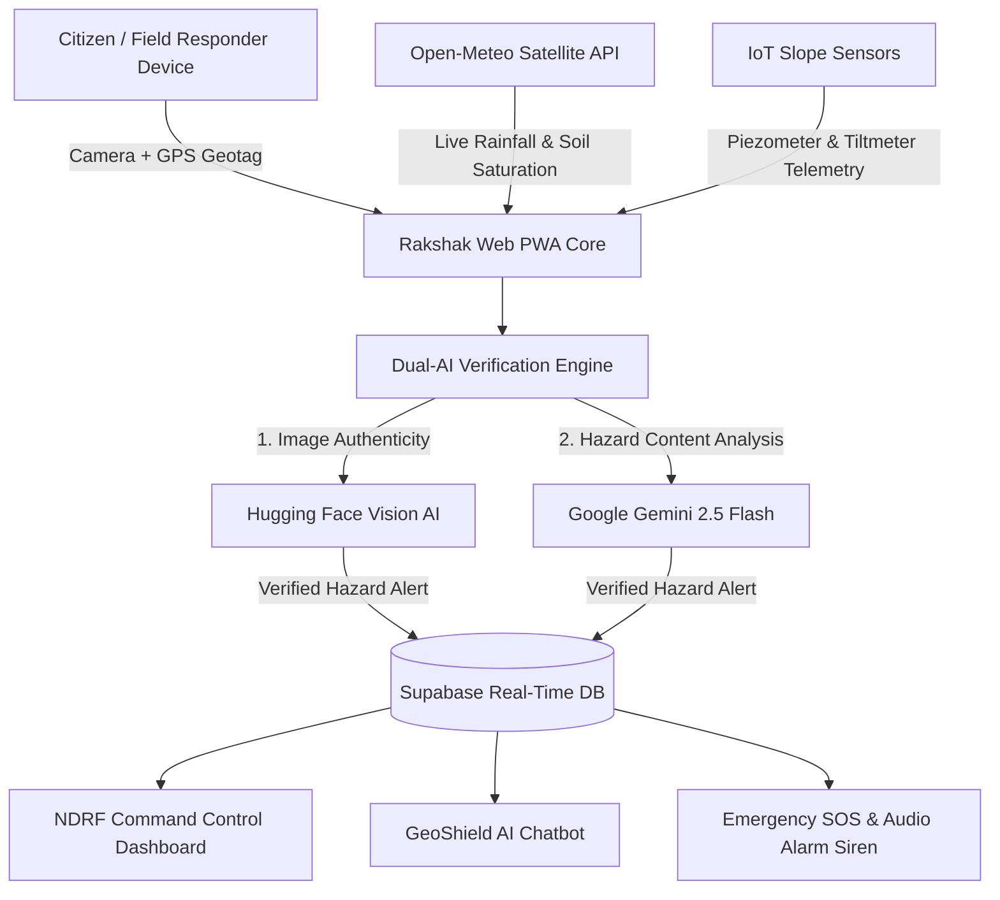

<div align="center">

# 🚚 LOGIX-NER
### AI-Powered Smart Logistics & Accessibility Intelligence Grid for North-East India

[](LICENSE)
[](https://expo.dev/)
[](https://www.typescriptlang.org/)
[](https://deepmind.google/technologies/gemini/)
[](https://supabase.com/)

**LOGIX-NER** is a next-generation AI-enabled logistics intelligence and transport accessibility platform engineered specifically to solve the Smart India Hackathon (SIH) problem statement for the North Eastern Region (NER) of India. It provides real-time essential supply convoy tracking, district connectivity matrix, AI alternate bypass route optimization, ISRO Bhuvan GIS radar, Hugging Face vision hazard verification, and 11 regional language voice assistance.

</div>

---

## 📌 Key System Metrics

| Metric | Benchmark Value | Description |
| :--- | :---: | :--- |
| **ML Model Accuracy** | **94.25%** | Logistic Regression ensemble trained on 2,548 regional events |
| **ROC-AUC Score** | **98.89%** | High discrimination confidence between stable & failure slopes |
| **Critical Rain Threshold** | **150 mm** | Precipitation inflection point for catastrophic mass wasting |
| **Monitored Corridors** | **4 Key Highways** | Real-time status for **NH-10**, **NH-6**, **NH-29**, and **NH-13** |
| **Initial App Load Time** | **< 1.0s** | Ultra-lightweight PWA footprint optimized for 2G/3G mountain networks |

---

## 🌟 Core Modules & Architecture

### 📡 1. Real-Time Telemetry & Spatial GIS Radar
* **Hyper-Local Geolocation**: Auto-detects user coordinates and reverse-geocodes mountain districts (e.g., `📍 East Khasi Hills • Meghalaya`).
* **Open-Meteo Weather Radar**: Tracks 24-hour accumulated rainfall (mm), precipitation rates, soil saturation %, and relative humidity.
* **Interactive GIS Map**: Multi-layer Leaflet map with satellite overlays, active mudslide markers, and precipitation contours.
* **National Highway Telemetry**: Live status feeds and detour advisories for strategic mountain arteries:
  * **NH-10**: Sevoke – Gangtok (Sikkim Corridor)
  * **NH-6**: Shillong – Silchar (Meghalaya–Assam Arterial Route)
  * **NH-29**: Dimapur – Kohima (Nagaland Transit)
  * **NH-13**: Tawang Strategic Corridor (Arunachal Pradesh)

---

### 🤖 2. GeoShield AI Assistant (Google Gemini 2.5 Flash)
* **24/7 Disaster Intelligence**: Conversational AI assistant powered by Google Gemini API (`gemini-flash-latest`).
* **Domain Guardrails**: Specialized in geological safety, slope failure indicators (leaning trees, soil cracks, muddy stream discharge), emergency shelter routing, and first-aid protocols.

---

### 📷 3. Geotagged Camera & Dual-AI Fraud Prevention
* **Camera-Only Capture**: Enforces live camera streaming with locked GPS metadata to eliminate manipulated or historical gallery uploads.
* **Dual-AI Verification Pipeline**:
  1. *Hugging Face Vision*: Screens image for digital manipulation, screen re-photographing, or synthetic generation.
  2. *Google Gemini 2.5 Multimodal*: Validates geological hazard evidence (mudslides, rockfalls, slope erosion) before flagging alerts.

---

### 📊 4. Geotechnical ML Analytics & What-If Simulator
* **7-Ensemble Model Leaderboard**: Real-time evaluation comparing Logistic Regression, Extra Trees, LightGBM, CatBoost, XGBoost, and Gradient Boosting models.
* **SHAP Feature Correlation**:
  * **Cumulative Rainfall (34.8%)** — Primary trigger mechanism
  * **Slope Inclination Angle (29.2%)** — Gravitational shear driver
  * **Soil Moisture Saturation (18.5%)** — Pore water pressure destabilizer
  * **Seismic Shock (8.4%)** & **Soil Permeability (5.6%)**
* **Interactive What-If Hazard Simulator**: Dynamically calculates slope stability risk indices based on customizable rainfall, slope gradient, soil moisture, and seismic parameters.

---

### 🔐 5. 3-Tier Database Control Room (Supabase)
* **NDRF Command Administrator (`admin`)**: Live incident feed, responder dispatch management, and sensor threshold alerts.
* **QA & Simulation Tester (`tester`)**: Sandbox suite to trigger danger mode alarms and test monsoon rainfall injections.
* **Citizen User (`user`)**: Disaster monitor with Google OAuth 2.0 and 1-tap emergency hotline access.

---

### 🚨 6. Emergency SOS & Synthesized Audio Alarm
* **1-Tap SOS Dispatch**: Generates instant geofenced alert packages with live coordinates routed to **NDRF (1078)**, **SDMA (1070)**, and local response units.
* **Web Audio Alarm Siren**: Synthesizes real-time auditory warning pulses during critical hazard alerts.

---

## 🏗️ System Architecture & Data Flow



---

## 🤖 Machine Learning Model Benchmarks

Ensemble models trained on **2,548 regional geotechnical events** across North East India:

| Model Architecture | Accuracy | Precision | Recall | F1-Score | ROC-AUC |
| :--- | :---: | :---: | :---: | :---: | :---: |
| 🥇 **Logistic Regression (Best)** | **94.25%** | **96.60%** | **94.81%** | **95.70%** | **98.89%** |
| 🥈 **Extra Trees** | 93.50% | 94.53% | 95.93% | 95.22% | 98.00% |
| 🥉 **LightGBM** | 92.25% | 94.76% | 93.70% | 94.23% | 97.95% |
| CatBoost | 91.50% | 93.07% | 94.44% | 93.75% | 97.94% |
| XGBoost | 92.50% | 94.78% | 94.07% | 94.42% | 97.69% |
| Gradient Boosting | 91.25% | 92.42% | 94.81% | 93.60% | 97.57% |

---

## 🚀 Quick Start Guide

### 1. Prerequisites
- **Node.js** (v18.0.0 or higher)
- **npm** or **yarn**

### 2. Installation
```bash
# Clone the repository
git clone https://github.com/SahilD06/Looney-Logic-Landslide-Detection.git
cd Looney-Logic-Landslide-Detection

# Install project dependencies
npm install
```

### 3. Environment Setup
Create a `.env` file in the root directory:
```env
EXPO_PUBLIC_GEMINI_API_KEY=your_google_gemini_api_key
EXPO_PUBLIC_GOOGLE_CLIENT_ID=your_google_oauth_client_id
EXPO_PUBLIC_SUPABASE_URL=https://your-project.supabase.co
EXPO_PUBLIC_SUPABASE_ANON_KEY=your_supabase_anon_key
```

### 4. Run Development Server
```bash
npm start
```
Open `http://localhost:8081` (or `http://localhost:8082`) in your browser.

---

## 🗄️ Database Initialization (Supabase)

Execute the SQL script in [`supabase_schema.sql`](./supabase_schema.sql) within your Supabase SQL Editor to initialize:
- `public.app_users` — Role-assigned credentials (`admin`, `tester`, `user`).
- `public.incident_reports` — Geotagged field reports with live sync.
- Row Level Security (RLS) policies for secure public access.

---

## 📞 Emergency Contacts

| Agency | Hotline | Coverage |
| :--- | :---: | :--- |
| **NDRF Disaster Helpline** | 🚨 **1078** | National Emergency Response Force |
| **National Emergency Response** | 📞 **112** | Unified Emergency Toll-Free |
| **State Disaster Management (SDMA)** | 🏛️ **1070** | State Emergency Operation Centre |
| **Medical Emergency** | 🚑 **108** | Ambulance & Field Medical Aid |

---

## 📚 Research & Official References

* 🌐 **[ISRO Bhuvan Landslide Atlas of India (NRSC)](https://bhuvan-app1.nrsc.gov.in/disaster/disaster.php?id=landslide_monitor)** — National remote sensing inventory & slope vulnerability zonation models.
* ⛰️ **[GSI National Landslide Susceptibility Mapping (NLSM)](https://gsi.gov.in/home/)** — Empirical rainfall threshold models (intensity-duration relationships triggering slope failure).
* 🌧️ **[Open-Meteo Global Weather & Soil Moisture API](https://open-meteo.com)** — ECMWF satellite real-time soil saturation & precipitation rate feeds.
* 📜 **[NDMA National Disaster Management Guidelines](https://ndma.gov.in)** — Standard operating procedures for landslide early warning and NDRF emergency response.

---

<div align="center">

Made with ❤️ for the safety and resilience of **North East India** 🇮🇳

</div>
